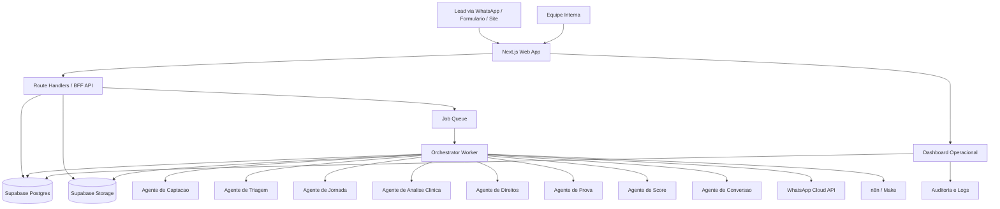
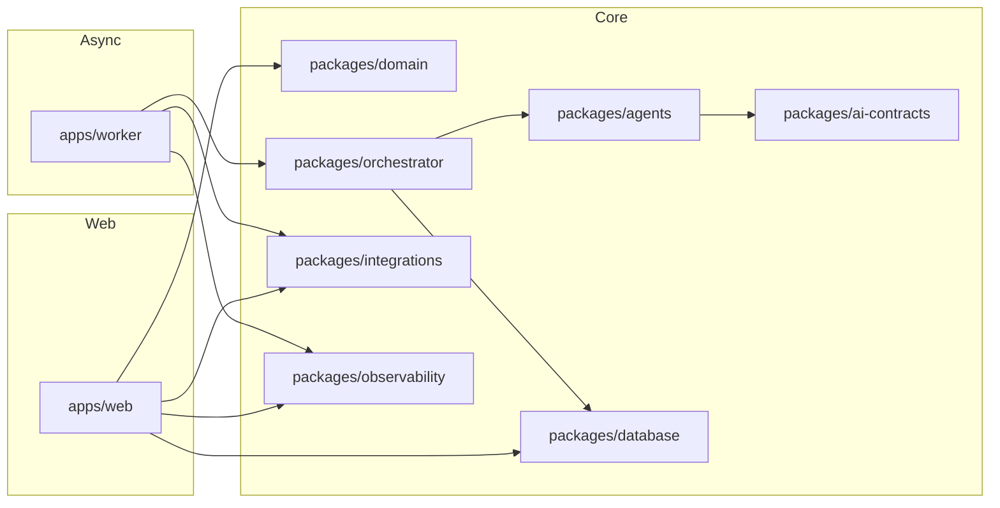
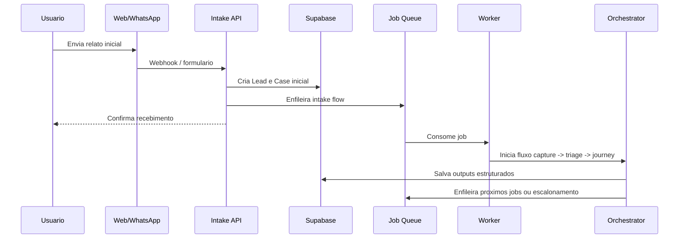
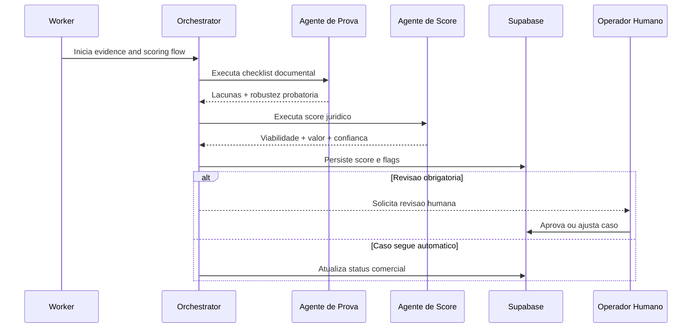

# SAFETYCARE Juridico Architecture Document

## Introduction

Este documento define a arquitetura do SAFETYCARE Juridico, cobrindo backend, frontend, workers, dados, integracoes, seguranca, observabilidade e operacao. O objetivo e servir como blueprint de implementacao para o sistema descrito em `docs/prd.md`, garantindo consistencia entre agentes, componentes internos e fluxos de negocio. Esta arquitetura privilegia rastreabilidade, human-in-the-loop, conformidade com LGPD e escalabilidade progressiva.

### Starter Template or Existing Project

N/A. O projeto sera iniciado como greenfield, mas seguira o preset ativo `nextjs-react` do framework AIOX como referencia de stack e padroes estruturais.

### Change Log

| Date | Version | Description | Author |
| --- | --- | --- | --- |
| 2026-04-25 | 1.0 | Primeira versao da arquitetura do SAFETYCARE Juridico derivada do PRD v4.0 | Codex + usuario |

## High Level Architecture

### Technical Summary

O SAFETYCARE Juridico sera implementado como um monolito modular em monorepo, com uma aplicacao web fullstack para canais publicos e operacao interna, complementada por um worker de background para orquestracao assicrona e processamento de filas. O sistema usara Supabase como base transacional, autenticacao interna, storage documental e politicas de acesso, enquanto o SafetyCare Orchestrator centralizara a execucao dos agentes de negocio. Integracoes com WhatsApp Cloud API, Make/n8n e servicos auxiliares ocorrerao por webhooks e adaptadores dedicados. A arquitetura foi desenhada para transformar relatos brutos em ativos juridicos auditaveis, mantendo controle humano sobre decisoes sensiveis.

### High Level Overview

- Estilo arquitetural principal: monolito modular orientado a eventos.
- Estrutura de repositorio: monorepo com aplicacoes e pacotes internos.
- Arquitetura de servico: aplicacao web fullstack + worker de processamento + servicos gerenciados.
- Fluxo principal: lead entra por WhatsApp/formulario/site, e registrado, enriquecido por agentes, consolidado em score e encaminhado para conversao e execucao juridica.
- Decisoes-chave:
- manter o banco transacional e documental no ecossistema Supabase para reduzir complexidade inicial;
- isolar processamento longo e retries em worker assicrono;
- concentrar regras de negocio em pacotes de dominio e orquestracao;
- impor human-in-the-loop nas etapas juridicas e comerciais de maior risco;
- registrar tudo em trilha de auditoria orientada a caso, execucao e usuario.

### High Level Project Diagram



### Architectural and Design Patterns

- **Monolito modular:** uma unica base de codigo com limites claros por dominio e ciclo de vida. _Rationale:_ reduz custo inicial, facilita rastreabilidade e acelera MVP sem perder organizacao.
- **Event-driven orchestration:** mudancas de estado do caso publicam eventos internos e jobs assicronos. _Rationale:_ desacopla intake, triagem, prova, score, conversao e notificacoes.
- **Domain packages + adapters:** regras de negocio em pacotes puros; integracoes externas em adaptadores. _Rationale:_ simplifica testes e evita acoplamento com APIs de terceiros.
- **Human-in-the-loop gates:** checkpoints obrigatorios para aprovacao humana antes de pecas externas, propostas sensiveis ou casos de baixa confianca. _Rationale:_ reduz risco regulatorio e operacional.
- **Audit-first design:** toda acao automatica ou humana relevante gera trilha de auditoria. _Rationale:_ alinhamento com LGPD, defensibilidade juridica e depuracao de incidentes.
- **Contract-first agent IO:** entradas e saidas de agentes em JSON versionado. _Rationale:_ facilita validacao, replay e evolucao gradual dos prompts/agentes.

## Tech Stack

### Cloud Infrastructure

- **Provider:** Supabase + Vercel + Railway
- **Key Services:** Supabase Postgres/Auth/Storage, Vercel para web app, Railway para worker e servicos auxiliares
- **Deployment Regions:** Brasil ou US-East para app/worker; regiao do projeto Supabase alinhada com latencia e compliance operacional

### Technology Stack Table

| Category | Technology | Version | Purpose | Rationale |
| --- | --- | --- | --- | --- |
| Monorepo | npm workspaces | 10.x | Gestao do monorepo | Alinha com o projeto atual e reduz friccao operacional |
| Runtime | Node.js | 22.x LTS | Runtime principal | Ecossistema maduro, suporte a Next.js e worker |
| Language | TypeScript | 5.x | Linguagem principal | Contratos fortes entre agentes, APIs e dominio |
| Web Framework | Next.js | 16.x | Aplicacao web fullstack | Preset ativo do framework AIOX, SSR, Route Handlers e dashboard |
| UI | React | 19.x | Base da interface | Compatibilidade com Next.js moderno |
| Styling | Tailwind CSS | 3.4.x | Estilizacao | Rapidez na construcao do painel operacional |
| UI Components | shadcn/ui | current scaffold | Componentes acessiveis | Boa ergonomia para backoffice operacional |
| Forms | React Hook Form | 7.x | Formularios internos e intake | Performance e boa integracao com Zod |
| Validation | Zod | 3.x | Validacao de contratos | Mesma linguagem para front, API e agentes |
| Server State | TanStack Query | 5.x | Cache e sincronizacao de dados | Ideal para dashboard e telas de operacao |
| Database | PostgreSQL | 16 | Banco principal | Consistencia transacional e relacional forte |
| BaaS | Supabase | managed | Auth, DB, Storage, RLS | Reduz tempo de setup e oferece primitives uteis |
| ORM / Query Layer | Drizzle ORM | 0.4x | Acesso tipado ao Postgres | SQL-first, leve e adequado para contratos claros |
| Queue | pg-boss | 10.x | Jobs assicronos | Evita Redis no MVP e usa o Postgres existente |
| Worker Framework | Node worker service | custom | Orquestracao e retries | Controle fino do pipeline de agentes |
| Automation | n8n | 1.x | Integracoes e automacoes | Maior controle interno; Make pode coexistir |
| Messaging | WhatsApp Cloud API | v20+ | Canal principal de entrada e resposta | Fit direto com intake conversacional |
| Observability | Sentry + OpenTelemetry | 9.x / 1.x | Erros, traces e monitoramento | Visibilidade de fluxo e falhas |
| Analytics / BI | Metabase | 0.5x | Dashboard executivo e analitico | Rapido para operacao e leitura de funil |
| Unit Testing | Vitest | 3.x | Testes unitarios | Rapido e integrado ao stack TS |
| Integration Testing | Vitest + Testcontainers | 3.x / 10.x | Testes de integracao | Valida banco, jobs e integracoes locais |
| E2E Testing | Playwright | 1.5x | Testes de fluxos criticos | Garante intake, triagem e backoffice |
| CI/CD | GitHub Actions | managed | Pipeline de build/test/deploy | O projeto ja possui estrutura `.github/` |

## Data Models

### Lead

**Purpose:** representa a entrada bruta de um potencial caso.

**Key Attributes:**
- `id`: uuid - identificador do lead
- `source`: enum - whatsapp, form, site, referral
- `name`: text - nome informado
- `phone`: text - telefone normalizado
- `raw_message`: text - relato original
- `status`: enum - new, acknowledged, qualified, discarded
- `received_at`: timestamptz - data de entrada

**Relationships:**
- um Lead pode originar um Caso
- um Lead possui muitos eventos de comunicacao

### Client

**Purpose:** representa a pessoa atendida ou responsavel pelo caso.

**Key Attributes:**
- `id`: uuid - identificador do cliente
- `lead_id`: uuid - lead de origem
- `full_name`: text - nome completo
- `cpf_hash`: text - hash do CPF quando coletado
- `email`: text - email de contato
- `phone`: text - telefone principal
- `consent_status`: enum - pending, granted, revoked

**Relationships:**
- um Client pode possuir varios Casos ao longo do tempo
- um Client possui Documentos, Comunicacoes e Consentimentos

### Case

**Purpose:** agregado principal de negocio.

**Key Attributes:**
- `id`: uuid - identificador do caso
- `client_id`: uuid - cliente associado
- `case_type`: enum - medical_error, hospital_failure, health_plan, aesthetics
- `priority`: enum - low, medium, high
- `urgency`: enum - low, medium, high, critical
- `commercial_status`: enum - screening, negotiating, closed_won, closed_lost
- `legal_status`: enum - intake, evidence, scored, approved, drafting, active, closed
- `estimated_value_cents`: bigint - valor potencial

**Relationships:**
- um Case possui muitos eventos de jornada, documentos, scores, analises e prazos
- um Case e a ancora da trilha de auditoria

### PatientJourneyEvent

**Purpose:** representa a timeline tecnica do caso.

**Key Attributes:**
- `id`: uuid - identificador do evento
- `case_id`: uuid - caso associado
- `event_type`: text - classificacao do evento
- `occurred_at_estimate`: date or timestamptz - data real ou estimada
- `description`: text - descricao do evento
- `risk_flag`: boolean - indica risco
- `source_excerpt`: text - trecho de origem

**Relationships:**
- pertence a um Case
- pode originar findings clinicos e violacoes de direitos

### ClinicalFinding

**Purpose:** armazena sinais tecnicos detectados na analise clinica.

**Key Attributes:**
- `id`: uuid
- `case_id`: uuid
- `journey_event_id`: uuid nullable
- `finding_type`: text - atraso, falha_protocolo, omissao etc.
- `confidence_level`: enum - low, medium, high
- `explanation`: text

**Relationships:**
- pertence a um Case
- pode estar associado a um evento de jornada

### RightsAssessment

**Purpose:** registra a avaliacao de direitos do paciente.

**Key Attributes:**
- `id`: uuid
- `case_id`: uuid
- `right_key`: enum - clear_information, informed_consent, records_access, continuity_of_care, patient_safety
- `status`: enum - ok, possible_violation
- `justification`: text

**Relationships:**
- pertence a um Case

### Document

**Purpose:** metadados dos arquivos do caso.

**Key Attributes:**
- `id`: uuid
- `case_id`: uuid
- `client_id`: uuid
- `document_type`: enum - exam, report, discharge, prescription, message, photo, contract, other
- `storage_path`: text
- `uploaded_by`: uuid nullable
- `verification_status`: enum - pending, accepted, rejected

**Relationships:**
- pertence a um Case e opcionalmente a um Client
- suporta checklist de prova e artefatos juridicos

### EvidenceChecklistItem

**Purpose:** controla robustez probatoria e lacunas.

**Key Attributes:**
- `id`: uuid
- `case_id`: uuid
- `item_key`: text
- `status`: enum - present, missing, partial, waived
- `importance`: enum - low, medium, high, critical
- `notes`: text

**Relationships:**
- pertence a um Case

### LegalScore

**Purpose:** consolidado de viabilidade juridica.

**Key Attributes:**
- `id`: uuid
- `case_id`: uuid
- `viability_score`: integer
- `complexity_level`: enum - low, medium, high
- `estimated_case_value_cents`: bigint
- `confidence_level`: enum - low, medium, high
- `review_required`: boolean

**Relationships:**
- pertence a um Case
- deriva de findings, checklist e assessments

### AgentRun

**Purpose:** execucao individual de um agente no pipeline.

**Key Attributes:**
- `id`: uuid
- `case_id`: uuid
- `agent_name`: text
- `input_payload`: jsonb
- `output_payload`: jsonb
- `status`: enum - queued, running, completed, failed, escalated
- `started_at`: timestamptz
- `finished_at`: timestamptz

**Relationships:**
- pertence a um Case
- pode originar AuditLogs e WorkflowJobs

### WorkflowJob

**Purpose:** unidade de processamento assicrono.

**Key Attributes:**
- `id`: uuid
- `case_id`: uuid nullable
- `job_type`: text
- `status`: enum - created, active, retrying, completed, failed, dead_letter
- `attempt_count`: integer
- `run_after`: timestamptz
- `correlation_id`: text

**Relationships:**
- pode estar vinculado a um Case
- e consumido pelo worker

### CommercialAction

**Purpose:** registra operacao comercial e de fechamento.

**Key Attributes:**
- `id`: uuid
- `case_id`: uuid
- `action_type`: enum - contact, follow_up, proposal, objection, close_won, close_lost
- `owner_user_id`: uuid
- `notes`: text
- `scheduled_for`: timestamptz nullable

**Relationships:**
- pertence a um Case
- alimenta metricas de conversao

### LegalArtifact

**Purpose:** rascunhos e versoes de pecas juridicas.

**Key Attributes:**
- `id`: uuid
- `case_id`: uuid
- `artifact_type`: enum - petition, injunction, notification, memo
- `version_number`: integer
- `status`: enum - draft, under_review, approved, exported
- `content_markdown`: text

**Relationships:**
- pertence a um Case
- depende de revisao humana

### Deadline

**Purpose:** controle de marcos temporais e alertas.

**Key Attributes:**
- `id`: uuid
- `case_id`: uuid
- `deadline_type`: text
- `due_at`: timestamptz
- `status`: enum - open, done, missed, canceled
- `alert_level`: enum - info, warning, critical

**Relationships:**
- pertence a um Case

### AuditLog

**Purpose:** trilha de auditoria transversal.

**Key Attributes:**
- `id`: uuid
- `case_id`: uuid nullable
- `actor_type`: enum - system, agent, user, integration
- `actor_id`: text
- `action`: text
- `before_payload`: jsonb nullable
- `after_payload`: jsonb nullable
- `created_at`: timestamptz

**Relationships:**
- pode estar associado a qualquer entidade chave

## Components

### apps/web

**Responsibility:** interface publica e interna do sistema.

**Key Interfaces:**
- paginas publicas de intake
- dashboard operacional e telas de caso
- route handlers para intake, consulta e acoes manuais

**Dependencies:** packages/domain, packages/database, packages/ai-contracts, packages/integrations

**Technology Stack:** Next.js 16, React 19, Tailwind, TanStack Query, Zod

### apps/worker

**Responsibility:** processar jobs assicronos, orquestrar agentes e executar retries.

**Key Interfaces:**
- consumer de fila
- pipelines do orquestrador
- adaptadores de notificacao e webhooks de saida

**Dependencies:** packages/orchestrator, packages/domain, packages/database, packages/integrations, packages/observability

**Technology Stack:** Node.js, TypeScript, pg-boss, OpenTelemetry

### packages/orchestrator

**Responsibility:** definir fluxo oficial do caso, gates de revisao e roteamento de agentes.

**Key Interfaces:**
- `runIntakeFlow(caseId)`
- `runScoringFlow(caseId)`
- `escalateForHumanReview(caseId, reason)`

**Dependencies:** packages/agents, packages/domain, packages/database

**Technology Stack:** TypeScript puro com contratos JSON versionados

### packages/agents

**Responsibility:** implementacoes dos agentes de captacao, triagem, jornada, analise clinica, direitos, prova, score e conversao.

**Key Interfaces:**
- `execute(input): output`
- schemas Zod por agente

**Dependencies:** packages/ai-contracts, packages/domain, packages/integrations

**Technology Stack:** TypeScript, Zod, adaptadores LLM

### packages/ai-contracts

**Responsibility:** contratos de IO, schemas, enums e DTOs dos agentes.

**Key Interfaces:**
- schemas de input/output
- normalizadores de payload

**Dependencies:** nenhuma alem de Zod

**Technology Stack:** TypeScript, Zod

### packages/domain

**Responsibility:** modelos de negocio, servicos de caso, regras de status e politicas internas.

**Key Interfaces:**
- agregados do caso
- servicos de elegibilidade, score gating e SLA

**Dependencies:** nenhuma de infra

**Technology Stack:** TypeScript puro

### packages/database

**Responsibility:** schema, migrations, repositories e acesso tipado ao Postgres.

**Key Interfaces:**
- repositories por agregado
- migracoes SQL
- funcoes de transacao

**Dependencies:** Supabase Postgres

**Technology Stack:** Drizzle ORM, SQL, pg driver

### packages/integrations

**Responsibility:** encapsular WhatsApp, n8n/Make, email e ferramentas externas.

**Key Interfaces:**
- `sendWhatsAppMessage`
- `publishAutomationEvent`
- `fetchWebhookSignatureVerifier`

**Dependencies:** secrets/config

**Technology Stack:** HTTP clients e SDKs oficiais quando cabivel

### packages/observability

**Responsibility:** logs, metricas, tracing e correlation IDs.

**Key Interfaces:**
- logger padrao
- tracer
- wrappers de job e request

**Dependencies:** Sentry, OpenTelemetry

**Technology Stack:** TypeScript

### Component Diagrams



## External APIs

### WhatsApp Cloud API

- **Purpose:** receber e enviar mensagens do canal principal de captacao.
- **Documentation:** https://developers.facebook.com/docs/whatsapp
- **Base URL(s):** `https://graph.facebook.com`
- **Authentication:** bearer token de app/system user
- **Rate Limits:** conforme limites da Meta por numero e tier de negocio

**Key Endpoints Used:**
- `POST /v20.0/{phone-number-id}/messages` - envio de mensagens
- `GET /v20.0/{phone-number-id}` - metadados do numero
- `POST /webhook` - recebimento de eventos via endpoint proprio

**Integration Notes:** validar assinatura do webhook, normalizar mensagens e armazenar payload bruto para auditoria.

### Supabase Platform API

- **Purpose:** dados, autenticacao interna e armazenamento documental.
- **Documentation:** https://supabase.com/docs
- **Base URL(s):** projeto Supabase
- **Authentication:** anon key, service role key e JWT do auth interno
- **Rate Limits:** gerenciados pelo plano contratado

**Key Endpoints Used:**
- `POST /rest/v1/*` - operacoes de dados quando aplicavel
- `POST /storage/v1/object/*` - upload e acesso a arquivos
- `POST /auth/v1/*` - autenticacao de usuarios internos

**Integration Notes:** service role apenas no worker/backend; app web usa sessao autenticada com RLS.

### n8n / Make

- **Purpose:** automacoes auxiliares, roteamentos externos e notificacoes operacionais.
- **Documentation:** ambiente interno do projeto
- **Base URL(s):** instancia configurada
- **Authentication:** webhook signing + API key quando aplicavel
- **Rate Limits:** dependem do plano/infra

**Key Endpoints Used:**
- `POST /webhook/safetycare/lead-received` - automacao de intake
- `POST /webhook/safetycare/case-updated` - sincronizacao de eventos

**Integration Notes:** n8n/Make nao substituem o orquestrador central; atuam como camada de integracao e notificacao.

## Core Workflows

### Lead Intake and Triage



### Evidence, Score and Human Review



## REST API Spec

```yaml
openapi: 3.0.3
info:
  title: SAFETYCARE Juridico API
  version: 1.0.0
  description: API interna e publica para intake, operacao de casos e dashboard.
servers:
  - url: https://api.safetycarejuridico.com
    description: Production
paths:
  /api/intake/lead:
    post:
      summary: Criar lead e caso inicial
  /api/webhooks/whatsapp:
    post:
      summary: Receber eventos do WhatsApp Cloud API
  /api/cases:
    get:
      summary: Listar casos com filtros operacionais
  /api/cases/{caseId}:
    get:
      summary: Obter caso consolidado
  /api/cases/{caseId}/review:
    post:
      summary: Registrar revisao humana
  /api/cases/{caseId}/documents:
    post:
      summary: Upload de documento do caso
  /api/cases/{caseId}/commercial-actions:
    post:
      summary: Registrar acao comercial
  /api/cases/{caseId}/legal-artifacts:
    post:
      summary: Criar rascunho juridico
  /api/dashboard/overview:
    get:
      summary: Retornar metricas executivas
components:
  schemas:
    LeadCreateRequest:
      type: object
      required: [source, message]
    CaseSummary:
      type: object
    ReviewDecision:
      type: object
```

## Database Schema

```sql
create table leads (
  id uuid primary key default gen_random_uuid(),
  source text not null,
  name text,
  phone text,
  raw_message text not null,
  status text not null default 'new',
  metadata jsonb not null default '{}'::jsonb,
  received_at timestamptz not null default now()
);

create table clients (
  id uuid primary key default gen_random_uuid(),
  lead_id uuid references leads(id),
  full_name text not null,
  cpf_hash text,
  email text,
  phone text,
  consent_status text not null default 'pending',
  consent_payload jsonb not null default '{}'::jsonb,
  created_at timestamptz not null default now()
);

create table cases (
  id uuid primary key default gen_random_uuid(),
  client_id uuid not null references clients(id),
  case_type text,
  priority text not null default 'medium',
  urgency text not null default 'medium',
  commercial_status text not null default 'screening',
  legal_status text not null default 'intake',
  estimated_value_cents bigint,
  current_owner_user_id uuid,
  created_at timestamptz not null default now(),
  updated_at timestamptz not null default now()
);

create table patient_journey_events (
  id uuid primary key default gen_random_uuid(),
  case_id uuid not null references cases(id) on delete cascade,
  event_type text not null,
  occurred_at_estimate timestamptz,
  description text not null,
  risk_flag boolean not null default false,
  source_excerpt text,
  metadata jsonb not null default '{}'::jsonb
);

create table clinical_findings (
  id uuid primary key default gen_random_uuid(),
  case_id uuid not null references cases(id) on delete cascade,
  journey_event_id uuid references patient_journey_events(id),
  finding_type text not null,
  confidence_level text not null,
  explanation text not null,
  created_at timestamptz not null default now()
);

create table rights_assessments (
  id uuid primary key default gen_random_uuid(),
  case_id uuid not null references cases(id) on delete cascade,
  right_key text not null,
  status text not null,
  justification text not null,
  unique (case_id, right_key)
);

create table documents (
  id uuid primary key default gen_random_uuid(),
  case_id uuid not null references cases(id) on delete cascade,
  client_id uuid references clients(id),
  document_type text not null,
  storage_path text not null,
  verification_status text not null default 'pending',
  uploaded_by uuid,
  created_at timestamptz not null default now()
);

create table evidence_checklist_items (
  id uuid primary key default gen_random_uuid(),
  case_id uuid not null references cases(id) on delete cascade,
  item_key text not null,
  status text not null,
  importance text not null,
  notes text,
  unique (case_id, item_key)
);

create table legal_scores (
  id uuid primary key default gen_random_uuid(),
  case_id uuid not null references cases(id) on delete cascade,
  viability_score integer not null,
  complexity_level text not null,
  estimated_case_value_cents bigint,
  confidence_level text not null,
  review_required boolean not null default false,
  rationale jsonb not null default '{}'::jsonb,
  created_at timestamptz not null default now()
);

create table agent_runs (
  id uuid primary key default gen_random_uuid(),
  case_id uuid references cases(id) on delete cascade,
  agent_name text not null,
  input_payload jsonb not null,
  output_payload jsonb,
  status text not null default 'queued',
  started_at timestamptz,
  finished_at timestamptz,
  error_message text
);

create table workflow_jobs (
  id uuid primary key default gen_random_uuid(),
  case_id uuid references cases(id) on delete cascade,
  job_type text not null,
  status text not null,
  attempt_count integer not null default 0,
  run_after timestamptz,
  correlation_id text not null,
  payload jsonb not null default '{}'::jsonb,
  created_at timestamptz not null default now()
);

create table commercial_actions (
  id uuid primary key default gen_random_uuid(),
  case_id uuid not null references cases(id) on delete cascade,
  action_type text not null,
  owner_user_id uuid,
  notes text,
  scheduled_for timestamptz,
  completed_at timestamptz
);

create table legal_artifacts (
  id uuid primary key default gen_random_uuid(),
  case_id uuid not null references cases(id) on delete cascade,
  artifact_type text not null,
  version_number integer not null default 1,
  status text not null default 'draft',
  content_markdown text not null,
  approved_by uuid,
  approved_at timestamptz
);

create table deadlines (
  id uuid primary key default gen_random_uuid(),
  case_id uuid not null references cases(id) on delete cascade,
  deadline_type text not null,
  due_at timestamptz not null,
  status text not null default 'open',
  alert_level text not null default 'info'
);

create table audit_logs (
  id uuid primary key default gen_random_uuid(),
  case_id uuid references cases(id) on delete cascade,
  actor_type text not null,
  actor_id text not null,
  action text not null,
  before_payload jsonb,
  after_payload jsonb,
  correlation_id text,
  created_at timestamptz not null default now()
);

create index idx_cases_status on cases (commercial_status, legal_status);
create index idx_workflow_jobs_status on workflow_jobs (status, run_after);
create index idx_audit_logs_case_id on audit_logs (case_id, created_at desc);
create index idx_documents_case_id on documents (case_id);
```

## Source Tree

```text
meu-projeto/
|-- apps/
|   |-- web/
|   |   |-- app/
|   |   |   |-- (public)/
|   |   |   |-- (internal)/
|   |   |   |-- api/
|   |   |-- src/
|   |   |   |-- features/
|   |   |   |-- shared/
|   |   |   |-- lib/
|   |   |   |-- config/
|   |   |-- tests/
|   |-- worker/
|   |   |-- src/
|   |   |   |-- consumers/
|   |   |   |-- workflows/
|   |   |   |-- schedulers/
|   |   |   |-- bootstrap/
|   |   |-- tests/
|-- packages/
|   |-- ai-contracts/
|   |-- agents/
|   |-- database/
|   |-- domain/
|   |-- integrations/
|   |-- observability/
|   |-- orchestrator/
|-- infra/
|   |-- supabase/
|   |-- vercel/
|   |-- railway/
|   |-- github/
|-- scripts/
|-- docs/
|   |-- prd.md
|   |-- prd/
|   |-- architecture.md
|   |-- architecture/
|-- package.json
|-- tsconfig.base.json
|-- .env.example
```

## Infrastructure and Deployment

### Infrastructure as Code

- **Tool:** Terraform 1.x + SQL migrations
- **Location:** `infra/`
- **Approach:** provisionamento declarativo para ambientes gerenciados e migracoes versionadas para banco

### Deployment Strategy

- **Strategy:** web app com deploy continuo e worker com rolling deploy
- **CI/CD Platform:** GitHub Actions
- **Pipeline Configuration:** `.github/workflows/`

### Environments

- **local:** desenvolvimento com banco remoto ou stack local simulada - foco em produtividade
- **staging:** homologacao integrada com webhooks de teste e dados anonimizados
- **production:** operacao real com secrets gerenciados, monitoramento e alertas ativos

### Environment Promotion Flow

```text
feature branch
  -> pull request
  -> lint + typecheck + unit tests + integration tests
  -> deploy preview (web)
  -> merge main
  -> staging deploy
  -> smoke checks
  -> production approval
  -> production deploy
```

### Rollback Strategy

- **Primary Method:** rollback por release da web + rollback por imagem do worker + reversao controlada de feature flags
- **Trigger Conditions:** aumento de erro, falha de ingestao, regressao de score, incidente de seguranca
- **Recovery Time Objective:** ate 30 minutos para restaurar operacao central

## Error Handling Strategy

### General Approach

- **Error Model:** erros tipados por camada (validation, integration, business, orchestration, security)
- **Exception Hierarchy:** domain errors separados de infra/integration errors
- **Error Propagation:** falhas previsiveis retornam resposta controlada; falhas assicronas geram retry ou dead-letter

### Logging Standards

- **Library:** logger interno + Sentry + OpenTelemetry
- **Format:** JSON estruturado
- **Levels:** debug, info, warn, error, fatal
- **Required Context:**
- Correlation ID: obrigatorio por request e job
- Service Context: app, component, agent, workflow
- User Context: apenas IDs internos; nunca PII bruta

### Error Handling Patterns

#### External API Errors

- **Retry Policy:** exponential backoff com jitter para falhas temporarias
- **Circuit Breaker:** aplicado a WhatsApp e automacoes externas
- **Timeout Configuration:** timeouts curtos na API publica e moderados no worker
- **Error Translation:** erros externos convertidos para categorias internas auditaveis

#### Business Logic Errors

- **Custom Exceptions:** invalid_case_state, missing_consent, insufficient_evidence, review_required
- **User-Facing Errors:** mensagens seguras e sem detalhes sensiveis
- **Error Codes:** namespace por modulo, ex. `CASE_REVIEW_REQUIRED`

#### Data Consistency

- **Transaction Strategy:** transacoes por agregado principal quando houver multiplos writes sincronicos
- **Compensation Logic:** jobs de compensacao para falhas em integracoes externas
- **Idempotency:** intake e webhooks externos com chaves idempotentes

## Coding Standards

### Core Standards

- **Languages & Runtimes:** TypeScript 5.x e Node.js 22.x
- **Style & Linting:** ESLint + Prettier com `strict` no TypeScript
- **Test Organization:** testes ao lado dos modulos ou em `tests/` por tipo

### Naming Conventions

| Element | Convention | Example |
| --- | --- | --- |
| Components | PascalCase | `CaseTimeline.tsx` |
| Route handlers | kebab-case path | `/api/cases/[caseId]/review` |
| Services | camelCase + Service | `caseScoringService.ts` |
| Repositories | camelCase + Repository | `caseRepository.ts` |
| Contracts | kebab-case + `.schema.ts` | `legal-score-output.schema.ts` |
| Jobs | snake_case | `case_scoring_requested` |
| Database tables | snake_case plural | `legal_scores` |

### Critical Rules

- **No direct LLM output persistence without validation:** toda saida de agente deve passar por schema Zod.
- **No PII in logs:** dados sensiveis nunca podem ir para logs ou traces.
- **No agent bypass of review gates:** flows de revisao nao podem ser pulados em codigo.
- **Repository boundary:** acesso ao banco apenas via `packages/database`.
- **Integration boundary:** chamadas externas apenas via `packages/integrations`.

## Test Strategy and Standards

### Testing Philosophy

- **Approach:** test-first para dominio e fluxos criticos; test-after assistido para telas nao criticas
- **Coverage Goals:** alto valor em dominio, intake, score e seguranca; cobertura moderada em UI administrativa
- **Test Pyramid:** predominio de unitarios, integracao forte em banco e workflows, E2E seletivo

### Test Types and Organization

#### Unit Tests

- **Framework:** Vitest 3.x
- **File Convention:** `*.test.ts` e `*.test.tsx`
- **Location:** junto ao modulo ou em `tests/unit`
- **Mocking Library:** Vitest mocks + MSW quando aplicavel
- **Coverage Requirement:** 80% em dominio, orquestracao e contratos

**AI Agent Requirements:**
- gerar testes para metodos publicos do dominio e orquestrador;
- cobrir edge cases, retries e gates de revisao;
- seguir AAA;
- mockar dependencias externas.

#### Integration Tests

- **Scope:** banco, queue, integracoes internas e route handlers
- **Location:** `tests/integration`
- **Test Infrastructure:**
- **Database:** Postgres de teste / Testcontainers
- **Queue:** pg-boss em banco de teste
- **External APIs:** stubs HTTP e fixtures de webhook

#### End-to-End Tests

- **Framework:** Playwright 1.5x
- **Scope:** intake publico, painel interno e revisao humana
- **Environment:** staging ou preview environment
- **Test Data:** fixtures anonimizadas e builders deterministicas

### Test Data Management

- **Strategy:** builders e seeds anonimizados por dominio
- **Fixtures:** `tests/fixtures`
- **Factories:** builders de Lead, Case, Score e Document
- **Cleanup:** rollback por transacao ou truncate controlado

### Continuous Testing

- **CI Integration:** lint -> typecheck -> unit -> integration -> smoke preview
- **Performance Tests:** basicos em endpoints de intake e dashboard
- **Security Tests:** scans de dependencia, SAST e testes de autorizacao

## Security

### Input Validation

- **Validation Library:** Zod
- **Validation Location:** boundary da API, consumers de webhook e IO de agentes
- **Required Rules:**
- todo input externo deve ser validado;
- validacao antes de qualquer persistencia ou execucao de agente;
- whitelisting por schema.

### Authentication & Authorization

- **Auth Method:** Supabase Auth para equipe interna
- **Session Management:** cookies seguros e JWT interno do Supabase
- **Required Patterns:**
- RLS para dados operacionais sensiveis;
- uso de service role apenas no worker e jobs confiaveis.

### Secrets Management

- **Development:** `.env.local` fora de versionamento
- **Production:** secrets do provedor de deploy + Supabase
- **Code Requirements:**
- nunca hardcode de secrets;
- acesso via camada de configuracao;
- nenhum secret em logs ou erros.

### API Security

- **Rate Limiting:** rate limiting por IP/origem no intake e nos webhooks publicos
- **CORS Policy:** restritiva para apps internos e origens conhecidas
- **Security Headers:** CSP, HSTS, X-Frame-Options, X-Content-Type-Options, Referrer-Policy
- **HTTPS Enforcement:** obrigatorio em todos os ambientes remotos

### Data Protection

- **Encryption at Rest:** storage e banco gerenciados com criptografia habilitada
- **Encryption in Transit:** TLS fim a fim
- **PII Handling:** mascaramento em interfaces secundarias e hash de identificadores sensiveis quando possivel
- **Logging Restrictions:** nao logar relato clinico bruto, documentos, CPF, prontuario ou tokens

### Dependency Security

- **Scanning Tool:** Dependabot + npm audit + SAST
- **Update Policy:** revisao semanal de vulnerabilidades
- **Approval Process:** nova dependencia passa por justificativa e impacto de seguranca

### Security Testing

- **SAST Tool:** CodeQL ou equivalente no GitHub Actions
- **DAST Tool:** scanner leve em staging para endpoints publicos
- **Penetration Testing:** antes de go-live e a cada mudanca sensivel relevante

## Checklist Results Report

Checklist de arquitetura ainda nao executado nesta primeira versao. Antes de iniciar implementacao, esta arquitetura deve ser revisada contra:

- aderencia ao PRD;
- modelo de dados real do MVP;
- estrategia juridica de revisao humana;
- LGPD e seguranca operacional;
- custo de infraestrutura e latencia do fluxo de intake.

## Next Steps

### Architect Prompt

Use este documento como base para uma arquitetura frontend detalhada do painel SAFETYCARE Juridico, cobrindo design system, auth UX, intake publico, timeline de caso, dashboard operacional e fluxos de revisao humana.

### Dev Prompt

Implemente primeiro o Epic 1 com base nesta arquitetura: fundacao do monorepo, schema inicial, intake API, fila assicrona, orquestrador skeleton, persistencia auditavel e painel minimo de casos.
