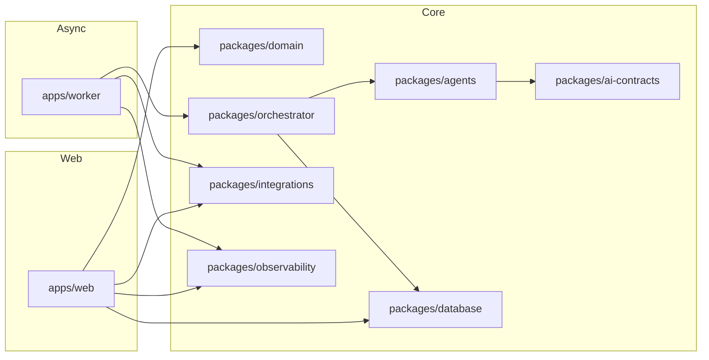

# Components

## apps/web

**Responsibility:** interface publica e interna do sistema.

**Key Interfaces:**
- paginas publicas de intake
- dashboard operacional e telas de caso
- route handlers para intake, consulta e acoes manuais

**Dependencies:** packages/domain, packages/database, packages/ai-contracts, packages/integrations

**Technology Stack:** Next.js 16, React 19, Tailwind, TanStack Query, Zod

## apps/worker

**Responsibility:** processar jobs assicronos, orquestrar agentes e executar retries.

**Key Interfaces:**
- consumer de fila
- pipelines do orquestrador
- adaptadores de notificacao e webhooks de saida

**Dependencies:** packages/orchestrator, packages/domain, packages/database, packages/integrations, packages/observability

**Technology Stack:** Node.js, TypeScript, pg-boss, OpenTelemetry

## packages/orchestrator

**Responsibility:** definir fluxo oficial do caso, gates de revisao e roteamento de agentes.

**Key Interfaces:**
- `runIntakeFlow(caseId)`
- `runScoringFlow(caseId)`
- `escalateForHumanReview(caseId, reason)`

**Dependencies:** packages/agents, packages/domain, packages/database

**Technology Stack:** TypeScript puro com contratos JSON versionados

## packages/agents

**Responsibility:** implementacoes dos agentes de captacao, triagem, jornada, analise clinica, direitos, prova, score e conversao.

**Key Interfaces:**
- `execute(input): output`
- schemas Zod por agente

**Dependencies:** packages/ai-contracts, packages/domain, packages/integrations

**Technology Stack:** TypeScript, Zod, adaptadores LLM

## packages/ai-contracts

**Responsibility:** contratos de IO, schemas, enums e DTOs dos agentes.

**Key Interfaces:**
- schemas de input/output
- normalizadores de payload

**Dependencies:** nenhuma alem de Zod

**Technology Stack:** TypeScript, Zod

## packages/domain

**Responsibility:** modelos de negocio, servicos de caso, regras de status e politicas internas.

**Key Interfaces:**
- agregados do caso
- servicos de elegibilidade, score gating e SLA

**Dependencies:** nenhuma de infra

**Technology Stack:** TypeScript puro

## packages/database

**Responsibility:** schema, migrations, repositories e acesso tipado ao Postgres.

**Key Interfaces:**
- repositories por agregado
- migracoes SQL
- funcoes de transacao

**Dependencies:** Supabase Postgres

**Technology Stack:** Drizzle ORM, SQL, pg driver

## packages/integrations

**Responsibility:** encapsular WhatsApp, n8n/Make, email e ferramentas externas.

**Key Interfaces:**
- `sendWhatsAppMessage`
- `publishAutomationEvent`
- `fetchWebhookSignatureVerifier`

**Dependencies:** secrets/config

**Technology Stack:** HTTP clients e SDKs oficiais quando cabivel

## packages/observability

**Responsibility:** logs, metricas, tracing e correlation IDs.

**Key Interfaces:**
- logger padrao
- tracer
- wrappers de job e request

**Dependencies:** Sentry, OpenTelemetry

**Technology Stack:** TypeScript

## Component Diagrams

