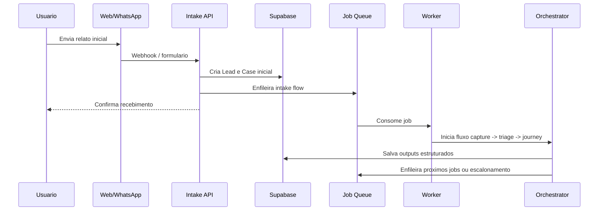
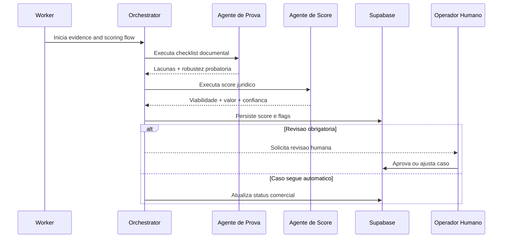

# Core Workflows

## Lead Intake and Triage

```mermaid
sequenceDiagram
    participant U as Usuario
    participant W as Web/WhatsApp
    participant API as Intake API
    participant DB as Supabase
    participant Q as Job Queue
    participant WK as Worker
    participant OR as Orchestrator

    U->>W: Envia relato inicial
    W->>API: Webhook / formulario
    API->>DB: Cria Lead e Case inicial
    API->>Q: Enfileira intake flow
    API-->>U: Confirma recebimento
    Q->>WK: Consome job
    WK->>OR: Inicia fluxo capture -> triage -> journey
    OR->>DB: Salva outputs estruturados
    OR->>Q: Enfileira proximos jobs ou escalonamento
```

## Evidence, Score and Human Review

```mermaid
sequenceDiagram
    participant WK as Worker
    participant OR as Orchestrator
    participant EV as Agente de Prova
    participant SC as Agente de Score
    participant DB as Supabase
    participant OP as Operador Humano

    WK->>OR: Inicia evidence and scoring flow
    OR->>EV: Executa checklist documental
    EV-->>OR: Lacunas + robustez probatoria
    OR->>SC: Executa score juridico
    SC-->>OR: Viabilidade + valor + confianca
    OR->>DB: Persiste score e flags
    alt Revisao obrigatoria
        OR-->>OP: Solicita revisao humana
        OP->>DB: Aprova ou ajusta caso
    else Caso segue automatico
        OR->>DB: Atualiza status comercial
    end
```
