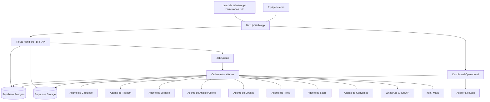

# High Level Architecture

## Technical Summary

O SAFETYCARE Juridico sera implementado como um monolito modular em monorepo, com uma aplicacao web fullstack para canais publicos e operacao interna, complementada por um worker de background para orquestracao assicrona e processamento de filas. O sistema usara Supabase como base transacional, autenticacao interna, storage documental e politicas de acesso, enquanto o SafetyCare Orchestrator centralizara a execucao dos agentes de negocio. Integracoes com WhatsApp Cloud API, Make/n8n e servicos auxiliares ocorrerao por webhooks e adaptadores dedicados. A arquitetura foi desenhada para transformar relatos brutos em ativos juridicos auditaveis, mantendo controle humano sobre decisoes sensiveis.

## High Level Overview

- Estilo arquitetural principal: monolito modular orientado a eventos.
- Estrutura de repositorio: monorepo com aplicacoes e pacotes internos.
- Arquitetura de servico: aplicacao web fullstack + worker de processamento + servicos gerenciados.
- Fluxo principal: lead entra por WhatsApp/formulario/site, e registrado, enriquecido por agentes, consolidado em score e encaminhado para conversao e execucao juridica.
- Decisoes-chave:
- manter o banco transacional e documental no ecossistema Supabase para reduzir complexidade inicial;
- isolar processamento longo e retries em worker assicrono;
- concentrar regras de negocio em pacotes de dominio e orquestracao;
- impor human-in-the-loop nas etapas juridicas e comerciais de maior risco;
- registrar tudo em trilha de auditoria orientada a caso, execucao e usuario.

## High Level Project Diagram

## Architectural and Design Patterns

- **Monolito modular:** uma unica base de codigo com limites claros por dominio e ciclo de vida. _Rationale:_ reduz custo inicial, facilita rastreabilidade e acelera MVP sem perder organizacao.
- **Event-driven orchestration:** mudancas de estado do caso publicam eventos internos e jobs assicronos. _Rationale:_ desacopla intake, triagem, prova, score, conversao e notificacoes.
- **Domain packages + adapters:** regras de negocio em pacotes puros; integracoes externas em adaptadores. _Rationale:_ simplifica testes e evita acoplamento com APIs de terceiros.
- **Human-in-the-loop gates:** checkpoints obrigatorios para aprovacao humana antes de pecas externas, propostas sensiveis ou casos de baixa confianca. _Rationale:_ reduz risco regulatorio e operacional.
- **Audit-first design:** toda acao automatica ou humana relevante gera trilha de auditoria. _Rationale:_ alinhamento com LGPD, defensibilidade juridica e depuracao de incidentes.
- **Contract-first agent IO:** entradas e saidas de agentes em JSON versionado. _Rationale:_ facilita validacao, replay e evolucao gradual dos prompts/agentes.
